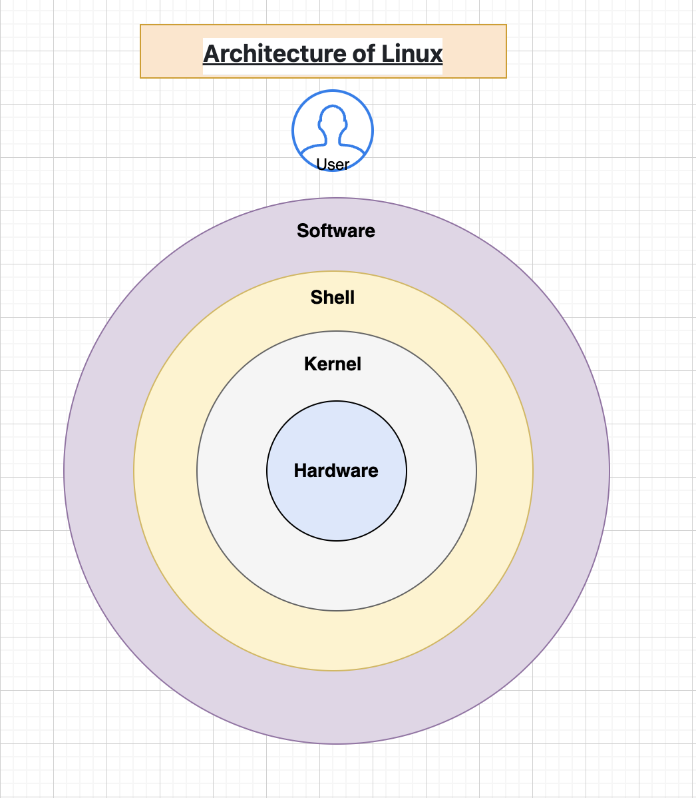

# **Introduction to DevOps**

## Day-1 📌 Overview
DevOps is a combination of **Development (Dev)** and **Operations (Ops)**.  
It focuses on collaboration, automation, and delivering software faster and more reliably.


---

## 🚀 What is DevOps?
- A culture and set of practices
- Automates software development and deployment
- Reduces manual work
- Ensures faster and reliable releases
- Helps teams collaborate better

### 🔥 Key Principles of DevOps
- Continuous Integration (CI)
- Continuous Delivery/Deployment (CD)
- Infrastructure as Code (IaC)
- Monitoring & Logging
- Automation everywhere

---

# **How IT Company Works**

## 🏢 Typical Department Workflow
An IT company usually has:

### 1️⃣ **Business / Sales Team**
- Talks to clients  
- Understands requirements  
- Sends proposals & pricing  

### 2️⃣ **Project Manager / Scrum Master**
- Plans project  
- Creates timelines  
- Assigns tasks  
- Ensures delivery  

### 3️⃣ **Developers**
- Write application code  
- Implement new features  
- Fix bugs  

### 4️⃣ **Testers / QA**
- Test application  
- Find bugs  
- Ensure quality before release  

### 5️⃣ **DevOps / Operations**
- Create environments  
- Manage servers  
- Automate deployments  
- Monitor applications  
- Ensure uptime & performance  

### 6️⃣ **Support Team**
- Handles live issues  
- Communicates with customers  

---

# **What is an Application?**

## 📌 Simple Definition
An **application** is a software program designed to perform specific tasks for users.

### 🧩 Types of Applications
- **Web Applications** (Amazon, YouTube)
- **Mobile Applications** (WhatsApp, Instagram)
- **Desktop Applications** (VS Code, Chrome)
- **Backend Services / APIs**
- **Microservices**

### 🛠 Application Components
A typical application has:
- **Frontend** → UI/UX (React, Angular)  
- **Backend** → Logic (Java, Python, Node.js)  
- **Database** → Data storage (MySQL, MongoDB)  

DevOps ensures these applications are deployed fast and run smoothly.

---

# **Developers vs Testers vs DevOps**

## 🧑‍💻 **Developers (Dev)**
- Write code  
- Build new features  
- Fix bugs  
- Commit code to Git  

### 🔧 Tools Used:
- VS Code  
- Git  
- Programming languages  
- APIs  

---

## 🧪 **Testers / QA**
- Test application quality  
- Report defects  
- Validate user experience  
- Perform manual/automation testing  

### 🔧 Tools Used:
- Selenium  
- JMeter  
- Postman  
- TestRail  

---

## ⚙️ **DevOps Engineers**
- Automate builds, deployments & monitoring  
- Manage CI/CD pipelines  
- Handle servers & cloud (AWS)  
- Ensure production stability  

### 🔧 Tools Used:
- Linux  
- Git & GitHub  
- Jenkins / GitHub Actions  
- Docker & Kubernetes  
- Terraform  
- AWS  
- Monitoring tools  

---

## 🔥 Simple Difference Table

| Role | Main Work | Goal | Tools |
|------|-----------|------|-------|
| **Developer** | Creates code | Build features | VS Code, Git, Languages |
| **Tester/QA** | Tests code | Ensure quality | Selenium, Postman |
| **DevOps** | Deploys & automates | Fast + stable delivery | Linux, GitHub Actions, AWS, Docker |

---

## 🎯 Key Takeaway
- Developers **create** the application  
- Testers **ensure quality**  
- DevOps **deploys, automates & maintains** the application  

Together, they deliver software **faster, safer, and more efficiently**.

---


# **The Strategic Imperative of DevOps**

## Day-2 📌 Overview
This module explains why DevOps has become essential for modern IT, the importance of Linux and AWS, and the growing career opportunities in DevOps.

---

## 🐧 **Top Features of Linux**
- Open-source and free
- Highly secure and stable
- Lightweight and fast
- Excellent for servers and cloud environments
- Strong community support
- Powerful command-line interface

---

## 🌍 **Linux Everywhere**
- Runs on servers, cloud platforms, mobile devices, routers, IoT, and supercomputers  
- Backbone of the DevOps ecosystem  
- Used heavily in AWS, Kubernetes, Docker, and CI/CD pipelines  

---

## 🔓 **Unlocking Linux Careers**
Career roles requiring Linux:
- DevOps Engineer  
- Cloud Engineer  
- SRE  
- System Administrator  
- Kubernetes Administrator  
- Security Engineer  

---

## ☁️ **Why AWS Stands Out in the Cloud Market**
- First-mover advantage  
- Largest service offering (200+ services)  
- Global infrastructure  
- High reliability and performance  
- Massive customer base and ecosystem  
- Easy integration with DevOps tools  

---

## 🧭 **Overview of AWS**
Key service categories:
- Compute (EC2, Lambda, ECS/Fargate)
- Storage (S3, EBS)
- Networking (VPC, Route 53)
- Databases (RDS, DynamoDB)
- IAM & Security
- Management & Monitoring (CloudWatch, CloudTrail)

---

## 🏆 **Customer Success Stories**
AWS is trusted by:
- Netflix  
- Airbnb  
- LinkedIn  
- NASA  
- Samsung  
- Adobe  
Businesses leverage AWS for scalability, reliability, and reduced operational costs.

---

## 📈 **Scalability & Flexibility of Business with AWS**
- Auto Scaling  
- Elastic Load Balancing  
- Pay-as-you-go model  
- Handle traffic spikes without downtime  
- Easily expand globally  

---

## ⚔️ **Comparing AWS with Competitors**
| Feature | AWS | Azure | GCP |
|--------|-----|-------|------|
| Market Share | ⭐ Highest | High | Moderate |
| Services | ⭐ Most | Many | Fewer |
| Learning Curve | Easy | Medium | Medium |
| Ecosystem | ⭐ Strongest | Strong | Strong |

AWS leads due to maturity, stability & community support.

---

## 💼 **Why DevOps Is a Growing Career Field**
- Companies want faster deployment  
- Need for automation  
- Rise of cloud computing  
- Increasing use of containers & Kubernetes  
- Continuous Integration & Continuous Delivery becoming standard  

---

## 📊 **High Demand for DevOps Professionals**
- Every tech-enabled company needs DevOps  
- Demand growing ~25–30% yearly  
- Shortage of skilled professionals = high salary  

---

## 💰 **Salary Expectations & Career Growth**
Approximate salary ranges (India):
- Junior DevOps Engineer: ₹4–7 LPA  
- Mid-level DevOps Engineer: ₹8–15 LPA  
- Senior DevOps Engineer: ₹18–30+ LPA  
- Cloud/DevOps Architect: ₹30–50 LPA  

---

## 🧠 **Skills & Expertise in DevOps**
- Linux  
- Git & GitHub  
- CI/CD – Jenkins, GitHub Actions  
- Cloud – AWS  
- Docker & Kubernetes  
- Terraform  
- Monitoring – Prometheus, Grafana  
- Scripting – Bash, Python  

---

## 🎓 **Certifications & Learning Resources**
Recommended certifications:
- AWS Cloud Practitioner  
- AWS Solutions Architect Associate  
- Kubernetes CKA  
- Terraform Associate  
- Azure Fundamentals (optional)  

---

## 🚀 **The Future of DevOps Careers**
- AI + DevOps = AIOps  
- More automation & intelligent pipelines  
- Rising importance of SRE roles  
- Almost every company will move towards DevOps-driven workflows  

---

## 🎯 **Goal to Achieve in CDEC**
By the end of this program, students will:
- Build strong Linux fundamentals  
- Master AWS essentials  
- Understand real-world DevOps workflows  
- Work with CI/CD tools  
- Deploy applications using Docker & Kubernetes  
- Prepare for DevOps interviews  
- Become job-ready for DevOps roles  

---
## Day-3 📌 Getting Started with Operating Systems
An **Operating System (OS)** is system software that manages hardware resources and allows applications to run smoothly.

---

## 🧠 Why Do We Need an OS?
- Manages CPU, RAM, Disk
- Runs applications
- Controls hardware
- Provides security
- Handles users & permissions
- Provides GUI & CLI

---

## 🖥️ Different Types of Operating Systems
- Batch OS
- Time-Sharing OS
- Distributed OS
- Network OS
- Mobile OS
- Embedded OS
- Real-Time OS (RTOS)

---

## 🌍 How Operating Systems Impact Daily Life
Operating systems power:
- Laptops & Desktops
- Mobile phones
- ATMs
- Smart TVs
- Cars
- Servers
- Cloud platforms
- IoT devices

**Every digital service uses an OS.**

---

## ⚔️ Windows vs Unix vs Linux
| Feature | Windows | Unix | Linux |
|--------|---------|------|--------|
| Type | Closed Source | Proprietary | Open Source |
| Cost | Paid | Paid | Free |
| Security | Medium | High | Very High |
| Interface | GUI | CLI | CLI + GUI |
| Usage | Personal Use | Enterprise Servers | DevOps, Cloud |
| Customization | Low | Low | Very High |

---

## 🏛️ Ownership and Origin
| OS | Owner | Year |
|----|--------|------|
| Windows | Microsoft | 1985 |
| Unix | AT&T Bell Labs | 1969 |
| Linux | Linus Torvalds | 1991 |

---

## 💰 Cost and Licensing
- **Windows** → Paid
- **Unix** → Expensive
- **Linux** → Free and open-source

---

## 🔐 Security and Privacy
- Windows → More prone to malware
- Unix → Very strong permissions
- Linux → Highly secure and stable

---

## 🖥️ User Interface
- Windows → GUI
- Unix → CLI
- Linux → CLI + Optional GUI

---

## 🏢 What is a Server?
A **server** is a powerful computer that provides services to clients (web, database, files, applications).

---

## 🖥️ Desktop OS vs Server OS
| Feature | Desktop OS | Server OS |
|--------|------------|------------|
| Purpose | Personal use | Hosting applications |
| GUI | Yes | Optional |
| Performance | Normal | High |
| Users | 1 user | Many clients |
| Examples | Windows 10, Ubuntu Desktop | RHEL, Ubuntu Server |

---

## 🐧 Introduction to Linux
Linux is an **open-source operating system kernel** widely used in DevOps, Cloud, and Servers.

### Why Linux for DevOps?
- Strong CLI
- Secure & stable
- Lightweight
- Server-friendly
- Used in AWS, Docker, Kubernetes

---

## 🏗️ Architecture of Linux
Linux has five main layers:
- Hardware
- Kernel
- shell 
- User Applications




### Kernel : 
    In simple terms, the Linux kernel is the core of the operating system that acts as a translator between software and hardware. It manages essential resources like the CPU and memory, and handles all communication, allowing applications to run without needing to know the specific details of the computer's hardware.  


### Shell :
```
A Linux shell is a program that acts as an interface between the user and the operating system's core, known as the kernel
```

### Hardware :

```
 Linux hardware is any physical component of a computer, like the CPU, RAM, and storage drives, that the Linux operating system manages and interacts

```

## Day-3 📌 Understanding the Linux Command Prompt
The **Linux command prompt** is where you type commands to interact with the operating system.  
It is the most powerful tool for DevOps engineers.

---

## 🧩 Decoding the Structure of the Command Prompt
A typical Linux prompt looks like this:

``
username@hostname:~$
``


**Breakdown:**
- `username` → Current logged-in user  
- `@` → Separator  
- `hostname` → System name  
- `:` → Separator  
- `~` → Current directory (home directory)  
- `$` → Normal user prompt (`#` for root user)

---

## 🧭 Effective Command Prompt Usage: A Step-by-Step Guide
- Identify your **user** and **location**  
- Understand the **$** vs **#** prompt difference  
- Use **TAB** for auto-completion  
- Use **UP/DOWN arrows** to navigate history  
- Use **CTRL + C** to stop running commands  
- Use **clear** or **CTRL + L** to clean the screen  

---

## 🎨 Making the Command Prompt Your Own (Advanced Customization)
You can customize your prompt by editing the PS1 variable.

Example:

`
PS1="\u@\h:\w$ "
`

Meaning:  
- `\u` → Username  
- `\h` → Hostname  
- `\w` → Working directory  

*This topic is advanced; beginners can skip customization.*

---

## 🐧 Introduction to Linux Basic Commands
Here are the most commonly used beginner commands:

- `pwd` → Show current directory  
- `ls` → List files  
- `cd` → Change directory  
- `clear` → Clear terminal  
- `whoami` → Show current user  
- `date` → Show current date and time  
- `history` → Show command history  
- `echo` → Print text  

---

## 🖥️ Getting Started with the Linux Terminal
The **terminal** is the interface where you type commands.

- GNOME Terminal  
- XTerm  
- Konsole  
- macOS Terminal  
- Windows WSL (for Linux on Windows)

How to open terminal:
- **Linux** → CTRL + ALT + T  
- **Mac** → Spotlight → Terminal  
- **Windows (WSL)** → wsl command  

---

## 🧾 Essential System Information Commands
- `uname -a` → Complete system details  
- `hostname` → Show system name  
- `uptime` → System load & running time  
- `date` → Current system date/time  
- `df -h` → Disk usage  
- `du -sh` → Size of a directory  
- `free -h` → RAM usage  
- `top` → Real-time processes  
- `who` → Logged-in users  

---
## 📂 Navigating the File System
Linux file system ek tree structure jaisa hota hai, jiska root `/` hota hai.

### 🔹 Basic Navigation Commands
- `pwd` → Show current directory  
- `ls` → List files  
- `ls -l` → Detailed list  
- `ls -a` → Show hidden files  
- `cd foldername` → Enter a folder  
- `cd ..` → Go one level back  
- `cd /` → Go to root  
- `cd ~` → Go to home  
- `cd /path/location` → Go to specific path  

### 🔸 Example:

`pwd  `

`ls -l  `

`cd /etc  `

`cd ..  `

`cd ~  `


---

## 📁 File and Directory Management

### 🔹 Creating Directories
`mkdir foldername  `
`mkdir -p a/b/c  `

### 🔹 Creating Files
`touch file.txt`

`touch file1 file2 file3 ` 

### 🔹 Copying Files
`cp file1 file2 `
 
`cp file.txt /path/location/` 

`cp -r folder1 folder2 `

### 🔹 Moving / Renaming Files
`mv oldname newname`  
`mv file.txt /path/ ` 

### 🔹 Deleting Files & Folders
`rm file.txt ` 
`rm -r foldername`  
`rm -rf foldername`   (⚠️ dangerous)  

---

## 📝 Viewing and Editing Files

### 🔹 Viewing Content
`cat file.txt`  
`less file.txt`  
`head file.txt`  
tail file.txt  
`tail -f file.txt `  (live logs)  

### 🔹 Editing Files
`nano file.txt  `
`vi file.txt  `

### 🔸 Example:
`cat /etc/os-release ` 
`head -20 logs.txt`  
`tail -f /var/log/syslog ` 
`vim notes.txt ` 

---

## 📦 Copy, Move, and Delete Files (Practical Examples)

### 🔹 Copy Examples
`cp index.html index-backup.html  `
`cp notes.txt /home/user/backup/ ` 
`cp -r project project-copy  `

### 🔹 Move / Rename Examples
`mv report.txt final-report.txt`  
`mv script.sh /usr/local/bin/`  
`mv *.txt documents/`  

### 🔹 Delete Examples
`rm temp.txt  `
`rm -r old-backup ` 
`rm -rf /tmp/testfolder`   (⚠️ irreversible)  

---

## ⭐ Real-Time DevOps Scenarios

### Scenario 1: Create a project structure  
`mkdir -p project/{src,logs,configs} ` 

### Scenario 2: Move a downloaded file  
`mv Downloads/file.sh project/scripts/  `

### Scenario 3: Check logs while deployment  
`tail -20 /var/log/app.log`  

### Scenario 4: Backup config before editing  
`cp nginx.conf nginx.conf.backup  `
`vim nginx.conf ` 


## 🎯 The Significance of the Linux File System Hierarchy
- Organizes files in a predictable structure  
- Ensures security through permissions  
- Makes automation easy  
- Helps in troubleshooting logs, configs & binaries  
- Every directory ka apna specific purpose hota hai  

Example:  
- Config files hamesha `/etc` me honge  
- Logs hamesha `/var/log` me honge  
- User data `/home` ke andar hoga  

---

## 📁 Inside the Linux Root Directory: What You Need to Know
Root directory `/` ke andar bahut saare **top-level folders** hote hain.  
Neeche unke important roles explain kiye gaye hain:

| Directory | Meaning | Example Usage |
|----------|---------|---------------|
| `/` | Root directory (top of the filesystem) | All other directories start from `/` |
| `/bin` | Essential user commands | ls, cp, mkdir |
| `/sbin` | System administration commands | reboot, fdisk |
| `/boot` | Bootloader files & kernel | vmlinuz, initrd.img |
| `/dev` | Device files | /dev/sda, /dev/tty |
| `/etc` | Configuration files | /etc/ssh/sshd_config |
| `/home` | User home directories | /home/rajat |
| `/lib` | Shared libraries for system | libc.so |
| `/media` | Auto-mounted removable media | Pendrive → /media/usb |
| `/mnt` | Temporary mount point | Mount external HDD |
| `/opt` | Optional / third-party apps | Google Chrome, VMware |
| `/proc` | Virtual kernel & process info | /proc/cpuinfo |
| `/root` | Home directory of root user | /root/.ssh/ |
| `/run` | Temporary runtime data (boot time) | /run/docker.pid |
| `/srv` | Server-specific data | Web server data |
| `/sys` | Kernel info & device management | /sys/class/net |
| `/tmp` | Temporary files | Session cache |
| `/usr` | User applications & binaries | /usr/bin/python3 |
| `/var` | Variable files (logs, cache) | /var/log/syslog |
 

---

## 🗂️ Understanding the Functionality of Common Linux Directories

### 🔹 `/bin`
Essential user commands:  
- `ls`  
- `cp`  
- `mv`  
- `cat`  

### 🔹 `/sbin`
System-level commands (root privileges required):  
- `shutdown`  
- `reboot`  
- `fdisk`  

### 🔹 `/etc`
Configuration files for applications & services:  
- `nginx.conf`  
- `fstab`  
- `ssh/sshd_config`  

### 🔹 `/home`
User-specific data (your personal files, documents, downloads).

### 🔹 `/var`
Frequently changing data:  
- `/var/log` → System logs (`syslog`, `auth.log`)  
- `/var/www` → Web server files  

### 🔹 `/tmp`
Temporary files that auto-delete after reboot.

### 🔹 `/usr`
User-installed applications and their libraries:  
- `/usr/bin`  
- `/usr/sbin`  
- `/usr/lib`

### 🔹 `/dev`
Device files representing hardware:  
- `/dev/sda` → Hard disk  
- `/dev/tty` → Terminal  

---

## ⌨️ Introduction to Linux Shortcuts: Boost Your Efficiency
Linux terminal shortcuts productivity ko boost karte hain.

### 🔹 Navigation Shortcuts
- `CTRL + A` → Go to start of line  
- `CTRL + E` → Go to end of line  
- `CTRL + U` → Clear before cursor  
- `CTRL + K` → Clear after cursor  

### 🔹 Command Execution Shortcuts
- `CTRL + C` → Stop running command  
- `CTRL + L` → Clear terminal  
- `UP ARROW` → Previous command  
- `DOWN ARROW` → Next command  
- `TAB` → Auto complete  

### 🔹 Useful Command Examples
```bash
cd /var/log
ls -l
cat syslog
sudo systemctl restart nginx

## 📘 Overview of Vim and its History
**Vim** (Vi IMproved) ek powerful text editor hai jo Linux/Unix systems me built-in hota hai.  
Vim ka base editor **vi** 1976 me bana tha, aur Vim ko 1991 me enhance kiya gaya.

Vim ke features:
- Extremely fast  
- Keyboard-driven  
- Used widely by DevOps, Linux admins, SRE  
- Very powerful for editing config files  
- Default editor for many Linux distros  

---

## 🎯 Basic Concepts: Modes in Vim
Vim ke 4 major modes hote hain:

### 🔹 1. Command Mode (Default Mode)
- File ko navigate, copy, delete aur change karne ke commands isi mode me hoti hain.  
- Jab aap Vim open karte ho → aap Command Mode me hote ho.

### 🔹 2. Insert Mode
- Text type karne ke liye.  
- Enter using: `i`, `a`, `o`, `I`, `A`, `O`

### 🔹 3. Visual Mode
- Select text for copying, deleting, changing.  
- Enter using: `v`, `V`, `CTRL + v`

### 🔹 4. Execute/Ex Mode (Command-Line Mode)
- File save, quit, replace, search commands.  
- Enter using `:` (colon)

---

## 🧭 Basic Navigation in Command Mode
Command mode me cursor ko move karne ke liye:

- `h` → Move left  
- `j` → Move down  
- `k` → Move up  
- `l` → Move right  

### 🔹 Word-based navigation
- `w` → Next word  
- `b` → Previous word  
- `e` → End of a word  

### 🔹 Line navigation
- `0` → Start of line  
- `$` → End of line  

### 🔹 File navigation
- `gg` → Go to top  
- `G` → Go to bottom  

---

## ✂️ Text Manipulation in Vim

### 🔹 Delete
- `x` → Delete a character  
- `dd` → Delete a whole line  
- `dw` → Delete a word  
- `d$` → Delete till end of line  

### 🔹 Copy (Yank)
- `yy` → Copy a line  
- `yw` → Copy a word  
- `y$` → Copy till end of line  

### 🔹 Paste
- `p` → Paste after cursor  
- `P` → Paste before cursor  

### 🔹 Replace
- `r` → Replace a single character  
- `R` → Replace multiple characters (overwrite mode)

---

## ↩️ Undo and Redo
- `u` → Undo  
- `CTRL + r` → Redo  

---

## ✏️ Entering Insert Mode

Insert mode enter karne ke tarike:

- `i` → Insert at cursor  
- `I` → Insert at start of line  
- `a` → Append after cursor  
- `A` → Append at end of line  
- `o` → Open new line below  
- `O` → Open new line above  

---

## 📝 Editing Text in Insert Mode

Insert mode me:
- Normal typing hoti hai  
- Navigation kare bina text edit hota hai  
- Backspace, delete, arrow keys work fine  

Example:
```bash
i
Hello DevOps Engineers!
Esc
